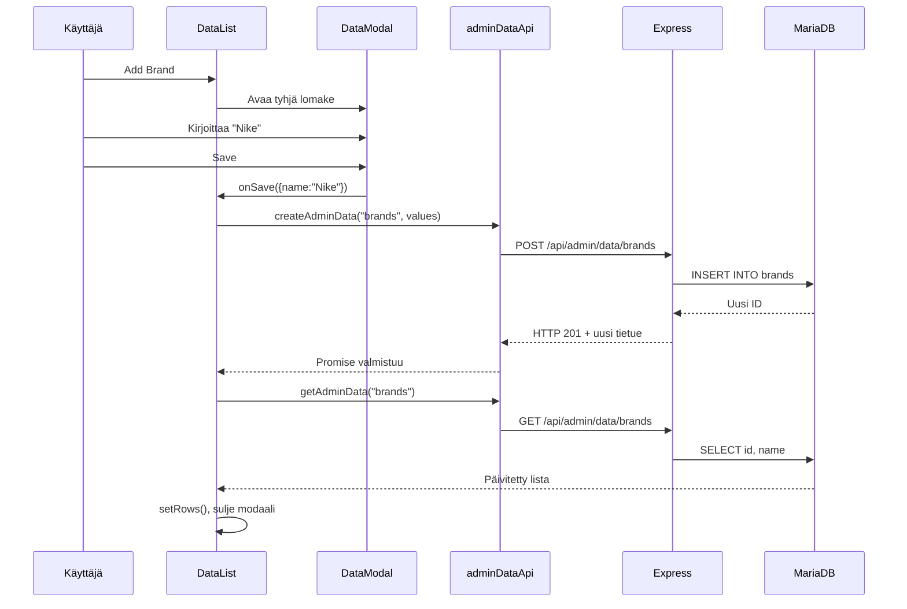

# Esimerkki Tuotemerkin lisäyksestä

```mermaid
sequenceDiagram
    participant U as Käyttäjä
    participant D as DataList
    participant M as DataModal
    participant A as adminDataApi
    participant E as Express
    participant DB as MariaDB

    U->>D: Add Brand
    D->>M: Avaa tyhjä lomake
    U->>M: Kirjoittaa "Nike"
    U->>M: Save
    M->>D: onSave({name:"Nike"})
    D->>A: createAdminData("brands", values)
    A->>E: POST /api/admin/data/brands
    E->>DB: INSERT INTO brands
    DB-->>E: Uusi ID
    E-->>A: HTTP 201 + uusi tietue
    A-->>D: Promise valmistuu
    D->>A: getAdminData("brands")
    A->>E: GET /api/admin/data/brands
    E->>DB: SELECT id, name
    DB-->>D: Päivitetty lista
    D->>D: setRows(), sulje modaali
```